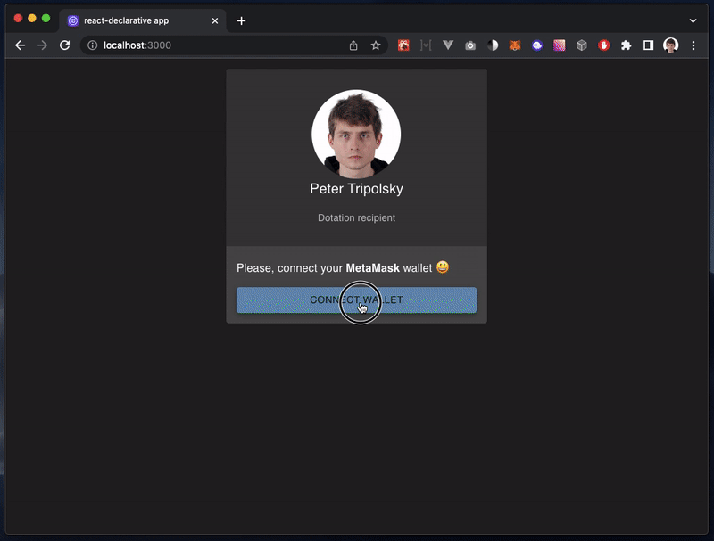

# erc20-payment-gateway

> A payment gateway for any `IERC20` tokens (USDT) with testbed on top of [TestERC20](https://stackoverflow.com/questions/75043524/minimal-erc20-contract-for-testing/75043525#75043525) token



## Contribute

> [!IMPORTANT]
> There is made by using [react-declarative](https://github.com/react-declarative/react-declarative) to solve your problems. **⭐Star** and **💻Fork** It on github will be appreciated

## Usage

1. Run `npm run start:ganache` in separated terminal
2. Run `npm run deploy:contracts` to deploy contracts to ganache
3. Run this DApp by running `npm start` in [client](./packages/client) folder. Send some tokens
4. Check admin menu by typing secret cheat-code `133337`
5. If you need test eth's on a balance check [config.json](./config.json). The smart-contract is going to mint 10_000 tokens for the first address in the list.

## Contract source code

> Solidity

```solidity
contract PaymentGatewayContract {

    IERC20 private erc20;
    address public owner;

    uint256 public deployBlock;

    constructor(address _erc20Address) {
        erc20 = IERC20(_erc20Address);
        owner = msg.sender;
        deployBlock = block.number;
    }

    function sendUSDT(uint256 _amount, bytes32 _data) public {
        uint256 allowance = erc20.allowance(msg.sender, address(this));

        require(allowance >= _amount, "ERC20 allowance not sufficient");
        bool transferSuccess = erc20.transferFrom(msg.sender, owner, _amount);

        require(transferSuccess, "Failed to transfer ERC20");
        emit Transfer(msg.sender, _amount, _data);
    }

    event Transfer(address indexed sender, uint256 amount, bytes32 _data);

}
```

> TypeScript

```tsx
export class ContractService {

    private readonly ethersService = inject<EthersService>(TYPES.ethersService);

    public readonly transferSubject = new Subject<{
        sender: string;
        amount: number;
        data: string;
    }>();

    private _instance: IContract = null as never;

    get isContractConnected() {
        return !!this._instance;
    };

    constructor() {
        makeAutoObservable(this);
    };

    getDeployBlock = async () => Number(await this._instance.deployBlock());

    sendUSDT = async (_amount: number, _data: string) => {
        const result = await this._instance.sendUSDT(String(_amount), toBytes32(_data));
        const rc = await result.wait();
        const event = rc.events.find((event: any) => event.event === 'Transfer');
        const [sender, amount, data] = event.args;
        return {
            sender,
            amount: Number(amount),
            data: fromBytes32(data),
        };
    };

    getTransferList = async () => {
        const eventSignature = 'Transfer(address,uint256,bytes32)';
        const eventTopic = ethers.utils.id(eventSignature);
        const deployBlock = await this.getDeployBlock();
        const currentBlock = await this.ethersService.provider.getBlockNumber();
        const parser = new ethers.utils.Interface(CC_CONTRACT_ABI);
        const rawLogs = await this.ethersService.provider.getLogs({
            address: CC_CONTRACT_ADDRESS,
            topics: [eventTopic],
            fromBlock: deployBlock, 
            toBlock: currentBlock,
        });
        return rawLogs.map((log, idx) => {
            const parsedLog = parser.parseLog(log);
            const [sender, amount, data] = parsedLog.args;
            return {
                id: `${idx}`,
                sender,
                amount: Number(amount),
                data: fromBytes32(data),
            };
        });
    };

    prefetch = singleshot(async () => {
        console.log("ContractService prefetch started");
        try {
            const deployedCode = await this.ethersService.getCode(CC_CONTRACT_ADDRESS);
            if (deployedCode === '0x') {
                throw new Error('ContractService contract not deployed');
            }
            const instance = new ethers.Contract(
                CC_CONTRACT_ADDRESS,
                CC_CONTRACT_ABI,
                this.ethersService.getSigner(),
            ) as IContract;
            runInAction(() => this._instance = instance);
            this.ethersService.provider.once("block", () => {
                instance.on('Transfer', (sender: string, amount: BigInt, data: string) => {
                    this.transferSubject.next({
                        sender,
                        amount: Number(amount),
                        data: fromBytes32(data),
                    });
                });
            });
        } catch (e) {
            console.warn('ContractService prefetch failed', e);
        }
    });

};
```
